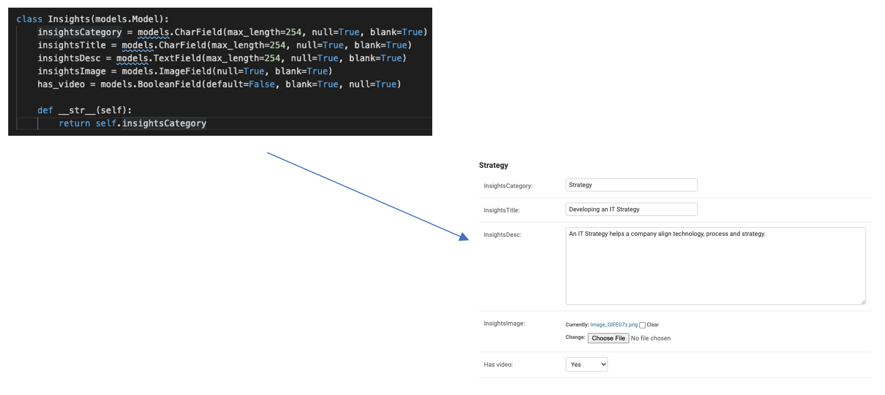

# Goat ability test using Django templating.

The style sheets in this repo are duplicate of the style sheet in the other repo. However, in this repo I have used Django and templating in HTML, using Django gives the end user the ability to log in to the admin and add content themselves. 

# Create a simple component
In this directory (devTest1), I create three models:
* Feature - which is for the featured row at the top of the page. 
* CategoryMemu - which is for the menu items
* Insights - which is for the insight cards. 

Pictured is the insights model in the models.py file, and the element it creates in the djano admin site. 
Once created a for loop using templating is used within the HTML file to iterate over each one added.
For the insight cards an if statement is used to evaluate whether the boolean field is True or False, if True the video icon in the top right of the card is included. 

